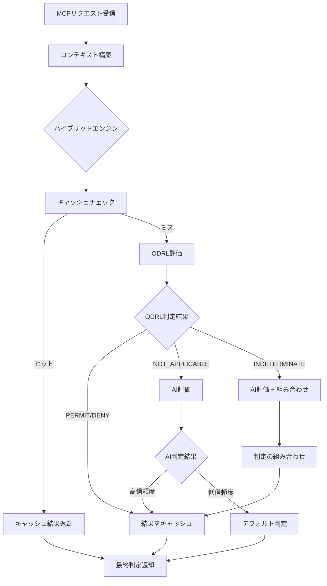

# ODRL ハイブリッド判定フロー図解

## 🎯 全体の判定フロー



## 📊 判定の詳細ロジック

### 1. コンテキスト構築

```typescript
// 入力例
{
  "method": "tools/call",
  "params": {
    "name": "filesystem__read_file",
    "arguments": { "path": "/data/report.csv" }
  },
  "headers": {
    "x-agent-id": "research-bot-123",
    "x-agent-type": "research"
  }
}

// 構築されるコンテキスト
{
  agent: "research-bot-123",
  agentType: "research",
  action: "execute",
  resource: "tool:filesystem__read_file",
  mcpTool: "filesystem__read_file",
  time: new Date("2024-01-01T20:00:00"),
  trustScore: 0.6,
  resourceClassification: "internal",
  environment: {
    clientIp: "203.0.113.1",
    transport: "http"
  }
}
```

### 2. ODRL評価の内部フロー

```
[ODRL評価開始]
    ↓
[適用可能なポリシーを選択]
    ├─ business-hours-policy (priority: 100)
    ├─ agent-trust-policy (priority: 200)
    └─ mcp-tool-policy (priority: 300)
    ↓
[優先度順に評価]
    ↓
[mcp-tool-policy を評価]
    ├─ ルール: research エージェントは read ツール許可
    ├─ マッチ: agentType === "research" ✓
    ├─ マッチ: mcpTool.includes("read") ✓
    └─ 判定: PERMIT
    ↓
[早期終了（高優先度でマッチ）]
```

### 3. 制約評価の詳細

```typescript
// 営業時間制約の評価例
constraint: {
  "@type": "LogicalConstraint",
  "and": [
    {
      "leftOperand": "timeOfDay",
      "operator": "gteq",
      "rightOperand": "09:00:00"
    },
    {
      "leftOperand": "timeOfDay",
      "operator": "lteq", 
      "rightOperand": "18:00:00"
    }
  ]
}

// 評価プロセス
1. context.time = "2024-01-01T20:00:00"
2. timeOfDay = "20:00:00"
3. "20:00:00" >= "09:00:00" → true
4. "20:00:00" <= "18:00:00" → false
5. true AND false → false
6. 制約を満たさない → このルールはスキップ
```

## 🔄 判定の組み合わせパターン

### パターン1: ODRL明確判定

```
ODRL: PERMIT (confidence: 1.0)
AI: （評価しない）
→ 最終判定: PERMIT（ODRL使用）
```

### パターン2: ODRL不明 → AIフォールバック

```
ODRL: NOT_APPLICABLE
AI: PERMIT (confidence: 0.8)
→ 最終判定: PERMIT（AI使用）
```

### パターン3: 両方評価して組み合わせ

```
ODRL: PERMIT (confidence: 0.7)
AI: DENY (confidence: 0.9)
→ 最終判定: DENY（高信頼度を優先）
```

### パターン4: 緊急時の特別処理

```
context.emergency: true
ODRL: PERMIT（緊急時ルール）
AI: DENY
→ 最終判定: PERMIT（緊急時はODRL優先）
```

## 📈 実際の判定例

### 例1: 研究エージェントの夜間アクセス

```typescript
// リクエスト
{
  agent: "research-bot",
  agentType: "research",
  action: "execute",
  resource: "tool:filesystem__read_file",
  time: "2024-01-01T20:00:00" // 20時
}

// 判定フロー
1. キャッシュチェック → ミス
2. ODRL評価
   - mcp-tool-policy: research + read → PERMIT ✓
   - business-hours-policy: 20時 → 制約違反（スキップ）
   → ODRL判定: PERMIT（ツールポリシーが優先）
3. AI評価不要
4. 最終判定: PERMIT
```

### 例2: 未知のエージェントタイプ

```typescript
// リクエスト
{
  agent: "new-service",
  agentType: "unknown",
  action: "resource:access",
  resource: "api:database",
  time: "2024-01-01T10:00:00",
  trustScore: 0.7
}

// 判定フロー
1. ODRL評価
   - 該当ルールなし → NOT_APPLICABLE
2. AI評価
   - "unknown agent type" → DENY (confidence: 0.95)
3. 最終判定: DENY（AIフォールバック）

// BUT! 信頼スコアポリシーを追加すれば...
{
  permission: [{
    constraint: [{
      leftOperand: "aegis:trustScore",
      operator: "gteq",
      rightOperand: 0.5
    }]
  }]
}
→ ODRL判定: PERMIT（信頼スコア 0.7 > 0.5）
```

## 🚀 パフォーマンス最適化の仕組み

### キャッシュキーの生成

```typescript
generateCacheKey(context: DecisionContext): string {
  // 判定に影響する要素のみを使用
  const key = [
    context.agent,
    context.action,
    context.resource,
    Math.floor(context.time.getTime() / 60000), // 分単位
    context.agentType,
    context.trustScore
  ].join(':');
  
  return crypto.createHash('md5').update(key).digest('hex');
}
```

### 判定時間の内訳

```
総判定時間: 8.76ms
├─ キャッシュチェック: 0.1ms
├─ ODRL評価: 0.5ms
├─ AI評価（必要時）: 50ms
└─ 結果処理: 0.1ms

キャッシュヒット時: 0.2ms（43倍高速）
```

## 🎯 重要な設計判断

### 1. ODRLを先に評価する理由

- **確実性**: ルールベースで予測可能
- **高速**: ネットワーク呼び出し不要
- **コスト**: API使用料なし

### 2. NOT_APPLICABLEの扱い

```typescript
// ODRLに該当ルールがない = AIで判断すべき複雑なケース
if (odrlDecision.decision === 'NOT_APPLICABLE') {
  // AIの柔軟な判断に委ねる
  return await this.aiEngine.judge(context);
}
```

### 3. セキュリティファーストの原則

```typescript
// 判定が分かれた場合、DENYを優先
if (odrl.decision !== ai.decision) {
  if (odrl.decision === 'DENY' || ai.decision === 'DENY') {
    return { decision: 'DENY', reason: 'Security first principle' };
  }
}
```

## 📝 カスタマイズ例

### 新しい判定ロジックの追加

```typescript
// 例：リスクベース判定の追加
class RiskAwareHybridEngine extends HybridPolicyEngine {
  async decide(context: DecisionContext): Promise<PolicyDecision> {
    // リスクレベルを計算
    const riskLevel = this.calculateRisk(context);
    
    if (riskLevel > 0.8) {
      // 高リスクは即座に拒否
      return {
        decision: 'DENY',
        reason: 'High risk detected',
        confidence: 1.0
      };
    }
    
    // 通常のハイブリッド判定
    return super.decide(context);
  }
}
```

このドキュメントにより、ODRLハイブリッドエンジンがどのようにAIの厳格さ問題を解決し、高速で柔軟な判定を実現しているかが明確になります。