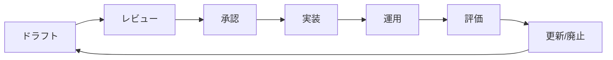

# ガバナンス運用ガイド

AEGISを使用した企業ガバナンスの実現と、ポリシー管理のベストプラクティスについて説明します。

## 🏛️ ガバナンス概要

### ガバナンスの3つの柱

1. **ポリシー管理**
   - 明確なポリシー定義
   - 承認プロセス
   - バージョン管理
   - 定期的なレビュー

2. **監査とコンプライアンス**
   - 完全な監査証跡
   - 規制要件への対応
   - 定期的な監査レポート
   - 違反の検出と対応

3. **リスク管理**
   - リスク評価
   - 予防的制御
   - インシデント対応
   - 継続的改善

## 📋 ポリシー管理プロセス

### 1. ポリシーライフサイクル



### 2. ポリシー作成ガイドライン

```typescript
// ポリシーテンプレート
const policyTemplate = {
  metadata: {
    id: "POL-2024-001",
    name: "データアクセスポリシー",
    version: "1.0.0",
    effectiveDate: "2024-01-01",
    owner: "security-team",
    approvers: ["ciso", "legal-team"],
    tags: ["data-protection", "compliance"],
    reviewCycle: "quarterly"
  },
  policy: `
【ポリシー名】
データアクセスポリシー v1.0

【目的】
組織のデータ資産を適切に保護し、認可されたアクセスのみを許可する

【適用範囲】
すべてのAIエージェントおよび自動化ツール

【基本原則】
1. 最小権限の原則
2. 職務分離の原則
3. 説明責任の原則

【詳細規定】
...
  `
};
```

### 3. 承認ワークフロー

```yaml
# approval-workflow.yml
workflow:
  name: "ポリシー承認プロセス"
  steps:
    - name: "ドラフト作成"
      owner: "policy-author"
      actions:
        - create_draft
        - request_review
    
    - name: "技術レビュー"
      owner: "technical-team"
      sla: "3_days"
      actions:
        - review_technical_feasibility
        - suggest_improvements
        - approve_or_reject
    
    - name: "法務レビュー"
      owner: "legal-team"
      sla: "5_days"
      actions:
        - review_compliance
        - check_regulations
        - approve_or_reject
    
    - name: "最終承認"
      owner: "ciso"
      sla: "2_days"
      actions:
        - final_review
        - sign_off
    
    - name: "実装"
      owner: "operations-team"
      actions:
        - deploy_to_staging
        - test_policy
        - deploy_to_production
```

## 📊 コンプライアンス管理

### 1. 規制要件マッピング

| 規制 | 要件 | AEGISでの実装 |
|------|------|---------------|
| **GDPR** | データ最小化 | アクセス制限ポリシー |
| | 同意管理 | 目的ベースアクセス制御 |
| | 削除権 | 自動削除義務 |
| | 監査ログ | 完全な監査証跡 |
| **SOX** | アクセス制御 | 職務分離ポリシー |
| | 監査証跡 | 改ざん防止ログ |
| **HIPAA** | 暗号化 | ログ暗号化機能 |
| | アクセス記録 | 詳細監査ログ |

### 2. コンプライアンスポリシー例

```javascript
const gdprCompliancePolicy = `
【GDPR準拠データアクセスポリシー】

データ最小化原則：
- 必要最小限のデータのみアクセス可能
- 目的外使用の完全禁止
- アクセス理由の明示必須

個人データ保護：
- EU居住者データへのアクセスは特別承認必要
- データの地域外転送禁止
- 暗号化必須

データ主体の権利：
- アクセス要求への24時間以内対応
- 削除要求への72時間以内対応
- 全アクセスの記録と開示準備

監査要件：
- 全アクセスの7年間保存
- 月次コンプライアンスレポート
- 年次外部監査対応
`;
```

## 🛡️ リスク管理

### 1. リスク評価マトリクス

```typescript
interface RiskAssessment {
  action: string;
  resource: string;
  likelihood: 'low' | 'medium' | 'high';
  impact: 'low' | 'medium' | 'high';
  riskLevel: 'acceptable' | 'moderate' | 'high' | 'critical';
  controls: string[];
}

const riskMatrix: RiskAssessment[] = [
  {
    action: "delete",
    resource: "production-data",
    likelihood: "low",
    impact: "high",
    riskLevel: "high",
    controls: [
      "管理者承認必須",
      "バックアップ確認",
      "削除ログの永続保存"
    ]
  },
  {
    action: "read",
    resource: "public-docs",
    likelihood: "high",
    impact: "low",
    riskLevel: "acceptable",
    controls: ["基本ログ記録"]
  }
];
```

### 2. 予防的制御

```javascript
const preventiveControls = {
  "異常検知": {
    description: "通常と異なるアクセスパターンの検出",
    implementation: `
      - 機械学習による異常スコアリング
      - ベースライン行動の学習
      - リアルタイムアラート
    `,
    threshold: {
      anomalyScore: 0.8,
      action: "block_and_alert"
    }
  },
  
  "アクセス頻度制限": {
    description: "過度なアクセスの防止",
    implementation: `
      - レート制限の実装
      - 段階的制限（警告→制限→ブロック）
      - ホワイトリスト例外
    `,
    limits: {
      perMinute: 100,
      perHour: 1000,
      perDay: 10000
    }
  },
  
  "データ分類制御": {
    description: "データ機密度に応じた制御",
    implementation: `
      - 自動データ分類
      - 機密度別アクセス制御
      - 暗号化要件の自動適用
    `
  }
};
```

## 📈 ガバナンスメトリクス

### 1. KPI設定

```yaml
governance_kpis:
  policy_compliance:
    - name: "ポリシー準拠率"
      target: "> 99%"
      calculation: "permits / total_requests"
      frequency: "daily"
    
    - name: "ポリシー違反検出時間"
      target: "< 5 minutes"
      measurement: "violation_detection_time"
      frequency: "per_incident"
  
  audit_effectiveness:
    - name: "監査ログ完全性"
      target: "100%"
      validation: "cryptographic_verification"
      frequency: "weekly"
    
    - name: "監査レポート作成時間"
      target: "< 2 hours"
      measurement: "report_generation_time"
      frequency: "monthly"
  
  risk_management:
    - name: "高リスクアクセスのブロック率"
      target: "> 95%"
      calculation: "blocked_high_risk / total_high_risk"
      frequency: "real_time"
    
    - name: "インシデント対応時間"
      target: "< 15 minutes"
      measurement: "incident_response_time"
      frequency: "per_incident"
```

### 2. ダッシュボード設定

```javascript
const governanceDashboard = {
  widgets: [
    {
      id: "compliance-score",
      type: "gauge",
      title: "コンプライアンススコア",
      query: `
        SELECT 
          (SUM(CASE WHEN compliant = true THEN 1 ELSE 0 END) / COUNT(*)) * 100 
        AS score
        FROM policy_evaluations
        WHERE timestamp > NOW() - INTERVAL 24 HOURS
      `,
      thresholds: {
        good: 95,
        warning: 90,
        critical: 85
      }
    },
    {
      id: "policy-violations",
      type: "timeseries",
      title: "ポリシー違反トレンド",
      query: `
        SELECT 
          DATE_TRUNC('hour', timestamp) as time,
          COUNT(*) as violations
        FROM audit_logs
        WHERE decision = 'DENY'
        GROUP BY time
        ORDER BY time
      `
    }
  ]
};
```

## 📋 監査対応

### 1. 監査準備チェックリスト

- [ ] 全ポリシーの文書化確認
- [ ] 承認記録の整備
- [ ] 監査ログの完全性検証
- [ ] アクセス権限の棚卸し
- [ ] インシデント対応記録の整理
- [ ] コンプライアンス証跡の準備
- [ ] 改善計画の文書化

### 2. 監査レポートテンプレート

```markdown
# AEGIS ガバナンス監査レポート

## エグゼクティブサマリー
- 監査期間: 2024年1月1日 - 2024年3月31日
- 監査範囲: 全AIエージェントアクセス制御
- 総合評価: 適合

## 監査結果

### 1. ポリシー管理
- 登録ポリシー数: 45
- 更新頻度: 月平均3.2回
- 承認プロセス準拠率: 100%

### 2. アクセス制御
- 総リクエスト数: 1,234,567
- 許可率: 94.3%
- 正当な拒否率: 5.7%
- 誤検知率: 0.02%

### 3. コンプライアンス
- GDPR準拠: ✓
- SOX準拠: ✓
- 内部統制: ✓

### 4. 改善提案
1. ポリシーレビュー頻度の向上
2. 自動化テストの拡充
3. 異常検知精度の改善
```

## 🔄 継続的改善

### 1. PDCAサイクル

```yaml
pdca_cycle:
  plan:
    - ポリシー要件の収集
    - リスク評価の実施
    - 改善計画の策定
  
  do:
    - ポリシーの実装
    - 制御の適用
    - モニタリング開始
  
  check:
    - 効果測定
    - 違反分析
    - ユーザーフィードバック収集
  
  act:
    - ポリシーの最適化
    - プロセスの改善
    - 教育・トレーニング
```

### 2. フィードバックループ

```javascript
const feedbackSystem = {
  collection: {
    channels: ["web_form", "api", "email", "slack"],
    categories: ["false_positive", "policy_unclear", "performance", "feature_request"]
  },
  
  processing: {
    sla: {
      acknowledgment: "24_hours",
      initial_response: "3_days",
      resolution: "14_days"
    },
    
    workflow: [
      "categorize",
      "prioritize",
      "assign_owner",
      "investigate",
      "implement_change",
      "verify",
      "close"
    ]
  },
  
  metrics: {
    satisfaction_score: "track_monthly",
    resolution_time: "track_per_ticket",
    implementation_rate: "track_quarterly"
  }
};
```

## 🎓 教育とトレーニング

### 1. トレーニングプログラム

| 対象者 | 内容 | 頻度 |
|--------|------|------|
| 新規ユーザー | AEGISの基本操作 | 入社時 |
| ポリシー作成者 | 自然言語ポリシーの書き方 | 四半期 |
| 管理者 | ガバナンス運用 | 半年 |
| 全員 | セキュリティ意識向上 | 年次 |

### 2. ドキュメント管理

```bash
docs/
├── governance/
│   ├── policies/          # ポリシー文書
│   ├── procedures/        # 手順書
│   ├── training/          # トレーニング資料
│   └── audit/             # 監査関連文書
├── compliance/
│   ├── gdpr/             # GDPR関連
│   ├── sox/              # SOX関連
│   └── industry/         # 業界固有規制
└── reports/
    ├── monthly/          # 月次レポート
    ├── quarterly/        # 四半期レポート
    └── annual/           # 年次レポート
```

## 📚 関連ドキュメント

- [ポリシー記述ガイド](../user-guide/policy-writing.md) - 効果的なポリシーの作成
- [監視・ログ管理](./monitoring.md) - 監査証跡の管理
- [API リファレンス](../developer-guide/api-reference.md) - ガバナンスAPI