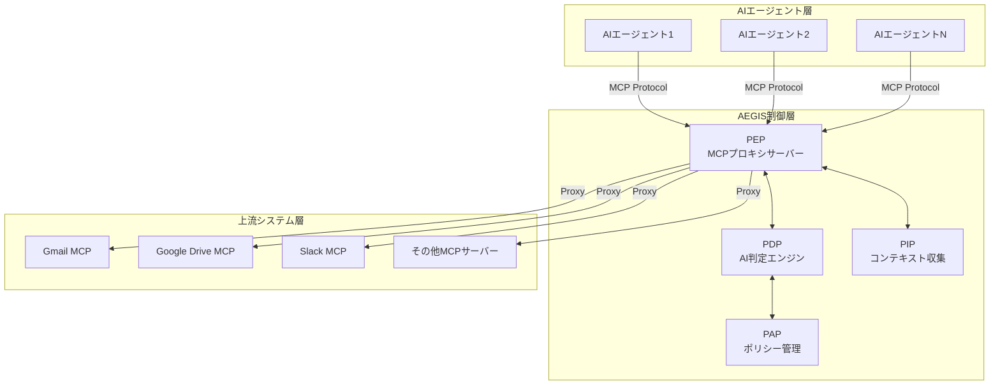
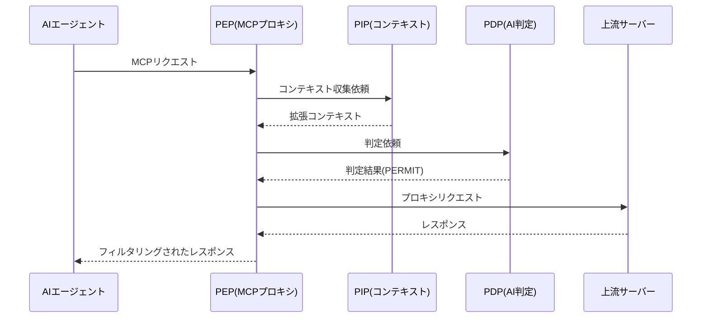
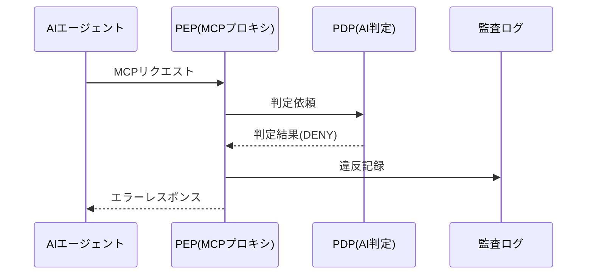

# AEGIS アーキテクチャ設計書

## 📋 目次

1. [概要](#概要)
2. [システム全体構成](#システム全体構成)
3. [コンポーネント詳細](#コンポーネント詳細)
4. [データフロー](#データフロー)
5. [技術スタック](#技術スタック)
6. [セキュリティ設計](#セキュリティ設計)
7. [スケーラビリティ](#スケーラビリティ)

## 概要

AEGIS (Agent Governance & Enforcement Intelligence System) は、自然言語ポリシーとAI判定エンジンを活用した次世代のアクセス制御システムです。従来のXACMLなどの複雑な記述形式を必要とせず、日本語で記述したポリシーをAIが理解・判定することで、柔軟で強力なガバナンス統制を実現します。

### 主要な設計原則

- **透明性**: MCPプロキシにより、既存のエージェントシステムを改修することなく制御を導入
- **柔軟性**: 自然言語によるポリシー記述で、複雑な条件も直感的に表現
- **拡張性**: プラグイン可能なアーキテクチャで、新しいコンテキスト情報源を容易に追加
- **信頼性**: AI判定の信頼度スコアとフォールバック機構により安定した動作を保証

## システム全体構成



## コンポーネント詳細

### 1. PEP (Policy Enforcement Point) - ハイブリッドMCPプロキシサーバー

**責務**: すべてのMCPリクエストをインターセプトし、ポリシー制御を透明に実行

**主要機能**:
- MCP公式仕様準拠のトランスポート実装
  - stdio（標準入出力）- 推奨
  - Streamable HTTP（HTTPストリーミング）
- リクエスト/レスポンスのインターセプト
- 制約・義務の実行
- 上流サーバーへの透過的プロキシ
- **ハイブリッドツール統合**:
  - 設定ベースMCPサーバー（filesystem, github等）
  - Claude Code内蔵ツール（Agent, Bash, Edit等）
  - 動的発見ツール（VSCode統合、サードパーティ）

**実装詳細**:
```typescript
// src/mcp/stdio-proxy.ts
export class MCPStdioPolicyProxy {
  private contextCollector: ContextCollector;
  private judgmentEngine: AIJudgmentEngine;
  private toolDiscovery: ToolDiscoveryService;
  
  async handleToolCall(request: any): Promise<any> {
    const toolName = request.params.name;
    const tool = this.toolDiscovery.getTool(toolName);
    
    // ツールソースに応じた処理
    if (tool.source.policyControlled) {
      // ポリシー判定
      const decision = await this.enforcePolicy('execute', `tool:${toolName}`, { request });
      if (decision.decision === 'DENY') {
        throw new Error(`Access denied: ${decision.reason}`);
      }
    }
    
    // ツールタイプに応じた実行
    switch (tool.source.type) {
      case 'configured':
        return await this.forwardToUpstream('tools/call', request.params);
      case 'native':
        return await this.executeNativeTool(toolName, request.params);
      case 'discovered':
        return await this.executeDiscoveredTool(tool, request.params);
    }
  }
}
```

**ツール発見サービス**:
```typescript
// src/mcp/tool-discovery.ts
export class ToolDiscoveryService {
  private registeredTools = new Map<string, DiscoveredTool>();
  
  // Claude Code内蔵ツールの登録
  registerNativeTools(): void {
    Object.entries(NATIVE_TOOLS).forEach(([name, info]) => {
      this.registeredTools.set(name, {
        name,
        description: info.description,
        source: {
          type: 'native',
          name: 'claude-code',
          policyControlled: this.shouldApplyPolicy(name, info.risk)
        }
      });
    });
  }
  
  // 動的ツールの登録
  registerToolFromClient(tool: any, sourceName: string): void {
    this.registeredTools.set(tool.name, {
      name: tool.name,
      source: {
        type: 'discovered',
        name: sourceName,
        policyControlled: this.shouldApplyPolicy(tool.name)
      }
    });
  }
}
```

### 2. PDP (Policy Decision Point) - AI判定エンジン

**責務**: 自然言語ポリシーを解釈し、コンテキストに基づいて判定を実行

**主要機能**:
- 自然言語ポリシーの解釈
- LLMを使用した柔軟な判定
- キャッシュによる高速化
- バッチ判定のサポート

**判定プロセス**:
1. ポリシーをシステムプロンプトに変換
2. コンテキスト情報を構造化
3. LLMに判定を依頼
4. 結果の検証とキャッシュ

### 3. PIP (Policy Information Point) - コンテキスト収集

**責務**: 判定に必要な環境情報を収集・拡張

**エンリッチャーカテゴリ**:

#### 時間ベース情報エンリッチャー
- 営業時間判定
- 祝日・週末判定
- タイムゾーン考慮

#### エージェント情報エンリッチャー
- クリアランスレベル
- 部署・役職情報
- 信頼度スコア計算

#### リソース分類エンリッチャー
- データ種別（PII、PHI、財務等）
- 機密度レベル
- 保持期間要件

#### セキュリティ情報エンリッチャー
- IPアドレス分析
- VPN接続判定
- 脅威スコア計算

#### データ系譜エンリッチャー
- データの出所・インポート履歴
- 変換・加工の追跡
- 依存リソースの管理
- アクセス履歴と頻度

### 4. PAP (Policy Administration Point) - ポリシー管理

**責務**: 自然言語ポリシーのライフサイクル管理

**主要機能**:
- ポリシーCRUD操作
- バージョン管理
- メタデータ管理
- インポート/エクスポート

### 5. EnforcementSystem (Phase 3) - 高度な制約・義務処理

**責務**: 判定結果に基づく高度な制約適用と義務実行

**アーキテクチャ**:
```typescript
// src/core/enforcement.ts
export class EnforcementSystem {
  private constraintManager: ConstraintProcessorManager;
  private obligationManager: ObligationExecutorManager;
}
```

#### 制約プロセッサー (ConstraintProcessorManager)

**実装済みプロセッサー**:

1. **DataAnonymizerProcessor** - データ匿名化
   - マスク化、トークン化、ハッシュ化、削除
   - 日本語対応（個人情報、マスク等のパターン認識）
   - 形式保持マスキング（メールアドレス、電話番号等）

2. **RateLimiterProcessor** - レート制限
   - スライディングウィンドウ方式
   - 時間単位（秒/分/時/日）対応
   - キャッシュ機能と自動クリーンアップ

3. **GeoRestrictorProcessor** - 地理的制限
   - IPベース位置判定
   - 国・地域単位での制限
   - 許可/拒否パターン設定

#### 義務エグゼキューター (ObligationExecutorManager)

**実装済みエグゼキューター**:

1. **AuditLoggerExecutor** - 監査ログ
   - 複数フォーマット対応（JSON、CSV、Syslog）
   - AES-256-GCM暗号化
   - 複数出力先（ファイル、DB、SIEM、クラウド）

2. **NotifierExecutor** - 通知システム
   - マルチチャンネル（Email、Slack、Teams、SMS、Webhook）
   - 優先度別通知
   - エスカレーション機能

3. **DataLifecycleExecutor** - データライフサイクル管理
   - スケジュールアクション（削除、アーカイブ、匿名化、エクスポート）
   - 保持期間管理
   - 事前通知機能

## データフロー

### 1. 通常のアクセス制御フロー



### 2. アクセス拒否フロー



## 技術スタック

### バックエンド
- **言語**: TypeScript (Node.js)
- **フレームワーク**: Express.js
- **AI/LLM**: OpenAI API / Anthropic Claude API

### インフラストラクチャ
- **コンテナ**: Docker
- **オーケストレーション**: Kubernetes (本番環境)
- **ロードバランサー**: NGINX
- **キャッシュ**: Redis

### 監視・ログ
- **ログ**: Winston
- **メトリクス**: Prometheus
- **可視化**: Grafana
- **トレーシング**: OpenTelemetry

## セキュリティ設計

### 1. 認証・認可
- **エージェント認証**: APIキーベース認証
- **管理者認証**: OAuth 2.0 / SAML
- **役割ベースアクセス制御**: ポリシー管理権限の分離

### 2. データ保護
- **転送時暗号化**: TLS 1.3
- **保存時暗号化**: AES-256
- **ポリシー署名**: デジタル署名による改ざん防止

### 3. 監査・コンプライアンス
- **完全監査証跡**: すべての判定とアクセスの記録
- **改ざん防止ログ**: ブロックチェーン連携（オプション）
- **規制対応**: GDPR、HIPAA、PCI-DSS準拠設計

## スケーラビリティ

### 水平スケーリング

```yaml
# Kubernetes設定例
apiVersion: apps/v1
kind: Deployment
metadata:
  name: aegis-pep
spec:
  replicas: 3  # 負荷に応じて自動スケール
  template:
    spec:
      containers:
      - name: pep
        image: aegis/pep:latest
        resources:
          requests:
            memory: "512Mi"
            cpu: "500m"
          limits:
            memory: "1Gi"
            cpu: "1000m"
```

### キャッシング戦略

1. **判定キャッシュ**: 同一条件の判定結果を一定期間キャッシュ
2. **コンテキストキャッシュ**: 頻繁に参照される情報をメモリキャッシュ
3. **ポリシーキャッシュ**: コンパイル済みポリシーをRedisに保存

### パフォーマンス最適化

- **バッチ処理**: 複数のリクエストを一括判定
- **非同期処理**: 義務実行の非同期化
- **接続プーリング**: 上流サーバーへの接続再利用

## 拡張ポイント

### 1. カスタムエンリッチャー
```typescript
export class CustomEnricher implements ContextEnricher {
  name = 'custom-enricher';
  
  async enrich(context: DecisionContext): Promise<Record<string, any>> {
    // カスタムロジックでコンテキストを拡張
    return {
      customField: await this.fetchCustomData(context)
    };
  }
}
```

### 2. カスタム制約・義務
```typescript
export class CustomConstraint implements Constraint {
  async apply(data: any, params: any): Promise<any> {
    // データ変換やフィルタリング
    return transformedData;
  }
}
```

### 3. 外部システム連携
- **SIEM連携**: セキュリティイベントの転送
- **ワークフロー連携**: 承認フローの自動化
- **通知連携**: Slack、メール通知

## 実装ロードマップ

### ✅ Phase 1: MVP完了
- ✅ PDP基本実装 (自然言語→AI判定)
- ✅ PEP基本実装 (MCPプロキシ)
- ✅ Claude Desktop統合
- ✅ 上流MCPサーバーのツール集約
- ✅ ツールルーティングとプレフィックス処理
- ✅ 基本的なポリシー制御の動作確認

### ✅ Phase 2: 基本機能完了
- ✅ PIP実装 (コンテキスト収集)
- ✅ PAP実装 (ポリシー管理)
- ✅ 制約・義務の基本実装
- ✅ stdio/HTTPトランスポート対応

### 🚧 Phase 3: 本格運用 (部分完了)
- ✅ 高度な制約・義務処理
  - ✅ ConstraintProcessorManager: 制約プロセッサ統合管理
  - ✅ DataAnonymizerProcessor: 高度な匿名化
  - ✅ RateLimiterProcessor: レート制限
  - ✅ GeoRestrictorProcessor: 地理的制限
  - ✅ ObligationExecutorManager: 義務エグゼキューター統合管理
  - ✅ AuditLoggerExecutor: 監査ログ
  - ✅ NotifierExecutor: 通知システム
  - ✅ DataLifecycleExecutor: データライフサイクル管理
  - ⚠️ MCPプロキシへの完全統合（部分的に実装、レガシーシステムと併存）
- ⏳ 監査・レポート機能（基本的な監査ログは実装済み、高度なレポート機能は未実装）
- ⏳ 性能最適化・スケーラビリティ

### 📋 Phase 4: エンタープライズ (計画中)
- ⏳ 高可用性・フェイルオーバー
- ⏳ 詳細な権限管理
- ⏳ 法的要件対応 (GDPR等)

## 現在の動作状況

**AEGIS MCPプロキシ**が正常に動作中：
- **12個のツール**がClaude Desktop経由で利用可能
- **ファイルシステム操作** (`filesystem__*`)
- **コマンド・コード実行** (`execution-server__*`)
- **内蔵ツール** (artifacts, repl, web_search, web_fetch)
- **リアルタイムポリシー制御**が全ツールに適用済み

### 移行状況
- **レガシーシステム**: 基本的な制約・義務処理（Phase 2実装）
- **新システム（EnforcementSystem）**: 高度な制約・義務処理（Phase 3実装）
- 現在は両システムが併存し、段階的に新システムへ移行中

## 従来IDSとの比較

| 要素 | 従来のIDS | AEGIS |
|------|-----------|--------|
| **ポリシー記述** | XACML/ODRL (XML) | 自然言語 |
| **判定エンジン** | ルールエンジン | AI/LLM |
| **統合方法** | アプリ改修必要 | MCPプロキシ (透明) |
| **設定管理** | 技術者専用 | 誰でも編集可能 |
| **柔軟性** | 事前定義ルールのみ | 動的推論 |
| **導入コスト** | 高 (大規模改修) | 低 (プロキシ設置のみ) |

## まとめ

AEGISのアーキテクチャは、従来の複雑なポリシー記述システムを自然言語とAIで置き換えることで、以下を実現します：

1. **導入の容易さ**: MCPプロキシによる透明な統合
2. **運用の簡素化**: 自然言語によるポリシー管理
3. **高度な柔軟性**: AIによる動的な判定
4. **エンタープライズ対応**: スケーラビリティとセキュリティ

この設計により、現代の複雑なAI環境において、効果的なガバナンス統制を実現します。