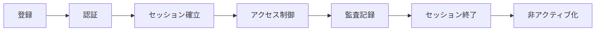

# エージェントシステム

AEGISにおけるエージェントの識別、管理、認証・認可の仕組みについて説明します。

## 🎯 エージェント概要

### エージェントとは

AEGISにおける「エージェント」は、MCPプロトコルを通じてリソースにアクセスするクライアントを指します：

- **AIエージェント**: Claude Desktop、GitHub Copilot、Cursor等
- **自動化ツール**: CI/CDパイプライン、バッチ処理システム
- **カスタムアプリケーション**: AEGIS APIを使用する独自アプリケーション
- **人間ユーザー**: Web UIやCLIを通じてアクセスするユーザー

### エージェントのライフサイクル



## 🔐 エージェント識別

### 1. エージェントID構造

```typescript
interface AgentIdentifier {
  // 一意識別子
  id: string;              // 例: "claude-desktop-001"
  
  // エージェント種別
  type: AgentType;         // "ai-assistant" | "automation" | "human" | "custom"
  
  // 組織情報
  organization?: string;   // 例: "engineering-team"
  department?: string;     // 例: "security"
  
  // 認証情報
  authMethod: AuthMethod;  // "api-key" | "oauth" | "certificate" | "jwt"
  
  // メタデータ
  metadata: {
    version?: string;      // エージェントのバージョン
    platform?: string;     // 実行プラットフォーム
    hostname?: string;     // ホスト名
    ip?: string;          // IPアドレス
    location?: string;    // 地理的位置
  };
}
```

### 2. エージェント登録

```typescript
export class AgentRegistry {
  private agents: Map<string, Agent> = new Map();
  
  async registerAgent(config: AgentConfig): Promise<Agent> {
    // ID生成
    const agentId = this.generateAgentId(config);
    
    // バリデーション
    await this.validateAgentConfig(config);
    
    // エージェント作成
    const agent: Agent = {
      id: agentId,
      type: config.type,
      name: config.name,
      description: config.description,
      authMethod: config.authMethod,
      credentials: await this.hashCredentials(config.credentials),
      permissions: config.permissions || [],
      metadata: {
        ...config.metadata,
        createdAt: new Date(),
        createdBy: getCurrentUser(),
        status: 'active'
      }
    };
    
    // 永続化
    await this.storage.save(agent);
    this.agents.set(agentId, agent);
    
    // 監査ログ
    await this.auditLogger.log({
      event: 'agent.registered',
      agent: agentId,
      details: { type: agent.type, name: agent.name }
    });
    
    return agent;
  }
  
  private generateAgentId(config: AgentConfig): string {
    // 意味のある、人間が読めるID生成
    const prefix = config.type.split('-')[0];
    const name = config.name.toLowerCase().replace(/\s+/g, '-');
    const suffix = generateShortId();
    
    return `${prefix}-${name}-${suffix}`;
    // 例: "ai-claude-desktop-x7k9"
  }
}
```

### 3. 動的エージェント検出

```typescript
export class DynamicAgentDetection {
  async detectAgent(request: MCPRequest): Promise<AgentInfo> {
    const detectedInfo: Partial<AgentInfo> = {};
    
    // ヘッダーからの検出
    if (request.headers) {
      detectedInfo.userAgent = request.headers['user-agent'];
      detectedInfo.clientId = request.headers['x-client-id'];
      detectedInfo.version = request.headers['x-client-version'];
    }
    
    // 接続情報からの検出
    if (request.connection) {
      detectedInfo.ip = request.connection.remoteAddress;
      detectedInfo.port = request.connection.remotePort;
    }
    
    // パターンマッチングによる種別判定
    detectedInfo.type = this.detectAgentType(detectedInfo);
    
    // 既知のエージェントとの照合
    const knownAgent = await this.matchKnownAgent(detectedInfo);
    
    if (knownAgent) {
      return knownAgent;
    }
    
    // 新規エージェントの場合
    return this.createTemporaryAgent(detectedInfo);
  }
  
  private detectAgentType(info: Partial<AgentInfo>): AgentType {
    const userAgent = info.userAgent?.toLowerCase() || '';
    
    if (userAgent.includes('claude-desktop')) {
      return 'ai-assistant';
    } else if (userAgent.includes('github-actions')) {
      return 'automation';
    } else if (userAgent.includes('curl') || userAgent.includes('wget')) {
      return 'cli-tool';
    } else {
      return 'unknown';
    }
  }
}
```

## 🔑 認証・認可

### 1. 認証メカニズム

```typescript
export class AgentAuthenticator {
  private authProviders: Map<AuthMethod, AuthProvider>;
  
  async authenticate(request: AuthRequest): Promise<AuthResult> {
    const method = this.detectAuthMethod(request);
    const provider = this.authProviders.get(method);
    
    if (!provider) {
      throw new AuthError('Unsupported authentication method');
    }
    
    try {
      const result = await provider.authenticate(request);
      
      // セッション作成
      if (result.success) {
        const session = await this.createSession(result.agent);
        result.session = session;
      }
      
      // 監査ログ
      await this.auditLogger.log({
        event: result.success ? 'auth.success' : 'auth.failure',
        agent: result.agent?.id || 'unknown',
        method,
        ip: request.ip
      });
      
      return result;
    } catch (error) {
      throw new AuthError('Authentication failed', error);
    }
  }
}

// APIキー認証プロバイダー
export class ApiKeyAuthProvider implements AuthProvider {
  async authenticate(request: AuthRequest): Promise<AuthResult> {
    const apiKey = this.extractApiKey(request);
    
    if (!apiKey) {
      return { success: false, reason: 'API key not provided' };
    }
    
    // APIキーの検証
    const agent = await this.validateApiKey(apiKey);
    
    if (!agent) {
      return { success: false, reason: 'Invalid API key' };
    }
    
    // 有効期限チェック
    if (agent.apiKey.expiresAt && agent.apiKey.expiresAt < new Date()) {
      return { success: false, reason: 'API key expired' };
    }
    
    return {
      success: true,
      agent,
      method: 'api-key'
    };
  }
}

// JWT認証プロバイダー
export class JWTAuthProvider implements AuthProvider {
  async authenticate(request: AuthRequest): Promise<AuthResult> {
    const token = this.extractJWT(request);
    
    if (!token) {
      return { success: false, reason: 'JWT not provided' };
    }
    
    try {
      // JWT検証
      const payload = await this.verifyJWT(token);
      
      // エージェント情報取得
      const agent = await this.getAgentFromJWT(payload);
      
      return {
        success: true,
        agent,
        method: 'jwt',
        claims: payload
      };
    } catch (error) {
      return {
        success: false,
        reason: `JWT validation failed: ${error.message}`
      };
    }
  }
}
```

### 2. セッション管理

```typescript
export class SessionManager {
  private sessions: Map<string, Session> = new Map();
  private redis: RedisClient;
  
  async createSession(agent: Agent): Promise<Session> {
    const session: Session = {
      id: generateSessionId(),
      agentId: agent.id,
      createdAt: new Date(),
      lastActivity: new Date(),
      expiresAt: new Date(Date.now() + this.sessionTTL),
      metadata: {
        ip: agent.metadata.ip,
        userAgent: agent.metadata.userAgent
      }
    };
    
    // メモリとRedisに保存
    this.sessions.set(session.id, session);
    await this.redis.setex(
      `session:${session.id}`,
      this.sessionTTL / 1000,
      JSON.stringify(session)
    );
    
    return session;
  }
  
  async validateSession(sessionId: string): Promise<boolean> {
    // メモリキャッシュチェック
    let session = this.sessions.get(sessionId);
    
    if (!session) {
      // Redisから取得
      const data = await this.redis.get(`session:${sessionId}`);
      if (data) {
        session = JSON.parse(data);
        this.sessions.set(sessionId, session);
      }
    }
    
    if (!session) {
      return false;
    }
    
    // 有効期限チェック
    if (session.expiresAt < new Date()) {
      await this.invalidateSession(sessionId);
      return false;
    }
    
    // アクティビティ更新
    session.lastActivity = new Date();
    await this.updateSession(session);
    
    return true;
  }
}
```

## 📊 エージェントメタデータ

### 1. メタデータ収集

```typescript
export class AgentMetadataCollector {
  async collectMetadata(agent: Agent, request?: MCPRequest): Promise<AgentMetadata> {
    const metadata: AgentMetadata = {
      // 基本情報
      agentId: agent.id,
      type: agent.type,
      name: agent.name,
      
      // 組織情報
      organization: await this.getOrganization(agent),
      department: await this.getDepartment(agent),
      team: await this.getTeam(agent),
      
      // 技術情報
      version: agent.metadata.version,
      platform: agent.metadata.platform,
      capabilities: await this.detectCapabilities(agent),
      
      // セキュリティ情報
      clearanceLevel: await this.getClearanceLevel(agent),
      roles: await this.getRoles(agent),
      permissions: await this.getPermissions(agent),
      
      // 統計情報
      statistics: await this.getStatistics(agent),
      
      // コンテキスト情報
      context: request ? {
        ip: request.ip,
        location: await this.getLocation(request.ip),
        time: new Date(),
        sessionId: request.sessionId
      } : undefined
    };
    
    return metadata;
  }
  
  private async detectCapabilities(agent: Agent): Promise<Capability[]> {
    const capabilities: Capability[] = [];
    
    // エージェントタイプベースの基本能力
    switch (agent.type) {
      case 'ai-assistant':
        capabilities.push(
          { name: 'natural-language', version: '1.0' },
          { name: 'code-generation', version: '1.0' },
          { name: 'file-manipulation', version: '1.0' }
        );
        break;
      
      case 'automation':
        capabilities.push(
          { name: 'batch-processing', version: '1.0' },
          { name: 'scheduled-execution', version: '1.0' }
        );
        break;
    }
    
    // 追加能力の検出
    if (agent.metadata.supportedTools) {
      for (const tool of agent.metadata.supportedTools) {
        capabilities.push({
          name: `tool:${tool}`,
          version: '1.0'
        });
      }
    }
    
    return capabilities;
  }
}
```

### 2. メタデータエンリッチメント

```typescript
export class AgentInfoEnricher implements ContextEnricher {
  async enrich(context: DecisionContext): Promise<EnrichedAgentInfo> {
    const agent = await this.agentRegistry.getAgent(context.agent);
    
    if (!agent) {
      return { unknown: true };
    }
    
    const enriched: EnrichedAgentInfo = {
      // 基本情報
      id: agent.id,
      type: agent.type,
      name: agent.name,
      
      // セキュリティコンテキスト
      clearanceLevel: agent.clearanceLevel || 'basic',
      trustScore: await this.calculateTrustScore(agent),
      riskProfile: await this.assessRiskProfile(agent),
      
      // 行動分析
      behavior: await this.analyzeBehavior(agent),
      anomalyScore: await this.calculateAnomalyScore(agent, context),
      
      // アクセス履歴
      recentAccess: await this.getRecentAccess(agent.id),
      accessPatterns: await this.analyzeAccessPatterns(agent.id),
      
      // 関連情報
      associations: await this.getAssociations(agent)
    };
    
    return enriched;
  }
  
  private async calculateTrustScore(agent: Agent): Promise<number> {
    let score = 0.5; // ベーススコア
    
    // 登録期間による加点
    const ageInDays = (Date.now() - agent.createdAt.getTime()) / (1000 * 60 * 60 * 24);
    score += Math.min(ageInDays / 365, 0.2); // 最大0.2点
    
    // 成功率による加点
    const stats = await this.getAgentStats(agent.id);
    if (stats.totalRequests > 100) {
      score += (stats.permits / stats.totalRequests) * 0.2; // 最大0.2点
    }
    
    // 違反履歴による減点
    score -= stats.violations * 0.05; // 違反ごとに0.05点減点
    
    // インシデント履歴による減点
    score -= stats.incidents * 0.1; // インシデントごとに0.1点減点
    
    return Math.max(0, Math.min(1, score));
  }
}
```

## 🎭 エージェントプロファイル

### 1. プロファイル定義

```typescript
interface AgentProfile {
  // 識別情報
  agent: AgentIdentifier;
  
  // 能力プロファイル
  capabilities: {
    tools: string[];           // 使用可能なツール
    resources: string[];       // アクセス可能なリソース
    operations: string[];      // 実行可能な操作
  };
  
  // 制限プロファイル
  restrictions: {
    blacklistedTools: string[];     // 使用禁止ツール
    blacklistedResources: string[]; // アクセス禁止リソース
    timeRestrictions: TimeWindow[]; // 時間制限
    geoRestrictions: GeoLocation[]; // 地理的制限
  };
  
  // 行動プロファイル
  behavior: {
    normalPatterns: AccessPattern[];     // 通常のアクセスパターン
    peakHours: string[];                // ピーク時間帯
    averageRequestsPerHour: number;     // 平均リクエスト数/時
    typicalResources: ResourceUsage[];  // よく使うリソース
  };
  
  // セキュリティプロファイル
  security: {
    clearanceLevel: ClearanceLevel;
    roles: string[];
    permissions: Permission[];
    mfaRequired: boolean;
    ipWhitelist: string[];
  };
}
```

### 2. プロファイルベースの制御

```typescript
export class ProfileBasedAccessControl {
  async evaluateAccess(
    agent: Agent,
    request: AccessRequest
  ): Promise<AccessDecision> {
    // エージェントプロファイル取得
    const profile = await this.getAgentProfile(agent.id);
    
    // 基本的な能力チェック
    if (!this.hasCapability(profile, request)) {
      return {
        decision: 'DENY',
        reason: 'エージェントにこの操作の能力がありません'
      };
    }
    
    // 制限チェック
    const restriction = this.checkRestrictions(profile, request);
    if (restriction) {
      return {
        decision: 'DENY',
        reason: restriction.reason
      };
    }
    
    // 異常検知
    const anomaly = await this.detectAnomaly(profile, request);
    if (anomaly.score > 0.8) {
      return {
        decision: 'DENY',
        reason: '異常なアクセスパターンが検出されました',
        metadata: { anomalyScore: anomaly.score }
      };
    }
    
    // プロファイルベースの制約・義務
    const constraints = this.deriveConstraints(profile, request);
    const obligations = this.deriveObligations(profile, request);
    
    return {
      decision: 'PERMIT',
      reason: 'プロファイルベースの検証に合格',
      constraints,
      obligations
    };
  }
}
```

## 📈 エージェント分析

### 1. 行動分析

```typescript
export class AgentBehaviorAnalyzer {
  async analyzeBehavior(agentId: string): Promise<BehaviorAnalysis> {
    const logs = await this.auditLogger.getAgentLogs(agentId, {
      days: 30
    });
    
    return {
      // アクセスパターン
      accessPatterns: this.extractPatterns(logs),
      
      // 時間分析
      timeAnalysis: {
        activeHours: this.findActiveHours(logs),
        peakUsage: this.findPeakUsage(logs),
        unusualTimes: this.findUnusualTimes(logs)
      },
      
      // リソース使用分析
      resourceUsage: {
        topResources: this.getTopResources(logs),
        resourceCategories: this.categorizeResources(logs),
        accessFrequency: this.calculateFrequency(logs)
      },
      
      // リスク指標
      riskIndicators: {
        failureRate: this.calculateFailureRate(logs),
        sensitiveAccess: this.countSensitiveAccess(logs),
        policyViolations: this.countViolations(logs)
      }
    };
  }
  
  private extractPatterns(logs: AuditLog[]): AccessPattern[] {
    // 機械学習を使用してパターンを抽出
    const sequences = this.extractSequences(logs);
    const patterns = this.clusterSequences(sequences);
    
    return patterns.map(pattern => ({
      id: generateId(),
      sequence: pattern.sequence,
      frequency: pattern.count,
      probability: pattern.count / sequences.length,
      lastSeen: pattern.lastOccurrence
    }));
  }
}
```

### 2. 異常検知

```typescript
export class AgentAnomalyDetector {
  private model: AnomalyDetectionModel;
  
  async detectAnomaly(
    agent: Agent,
    context: DecisionContext
  ): Promise<AnomalyResult> {
    // 特徴量抽出
    const features = await this.extractFeatures(agent, context);
    
    // モデル予測
    const prediction = await this.model.predict(features);
    
    // 異常スコア計算
    const score = this.calculateAnomalyScore(prediction);
    
    // 詳細分析
    const details = score > 0.5 ? 
      await this.analyzeAnomaly(agent, context, prediction) : 
      null;
    
    return {
      score,
      isAnomaly: score > 0.8,
      confidence: prediction.confidence,
      details,
      features: score > 0.5 ? features : undefined
    };
  }
  
  private async extractFeatures(
    agent: Agent,
    context: DecisionContext
  ): Promise<FeatureVector> {
    const profile = await this.getAgentProfile(agent.id);
    const stats = await this.getRecentStats(agent.id);
    
    return {
      // 時間的特徴
      hourOfDay: new Date(context.time).getHours(),
      dayOfWeek: new Date(context.time).getDay(),
      isWeekend: [0, 6].includes(new Date(context.time).getDay()),
      timeSinceLastAccess: this.getTimeSinceLastAccess(agent.id),
      
      // アクセスパターン特徴
      requestFrequency: stats.recentRequestRate,
      failureRate: stats.recentFailureRate,
      resourceDiversity: stats.uniqueResourcesAccessed,
      
      // コンテキスト特徴
      isNewResource: !profile.behavior.typicalResources.includes(context.resource),
      isUnusualTime: !profile.behavior.peakHours.includes(String(new Date(context.time).getHours())),
      riskLevel: this.calculateResourceRisk(context.resource),
      
      // 地理的特徴
      isKnownLocation: profile.security.ipWhitelist?.includes(context.ip) || false,
      geoDistance: await this.calculateGeoDistance(agent, context.ip)
    };
  }
}
```

## 🔄 エージェントライフサイクル管理

### 1. エージェントの状態管理

```typescript
export class AgentLifecycleManager {
  async updateAgentStatus(
    agentId: string,
    status: AgentStatus,
    reason?: string
  ): Promise<void> {
    const agent = await this.agentRegistry.getAgent(agentId);
    
    if (!agent) {
      throw new Error(`Agent not found: ${agentId}`);
    }
    
    const previousStatus = agent.status;
    agent.status = status;
    agent.statusChangedAt = new Date();
    agent.statusReason = reason;
    
    // 状態遷移の検証
    this.validateStatusTransition(previousStatus, status);
    
    // 永続化
    await this.agentRegistry.updateAgent(agent);
    
    // 状態変更イベント発行
    await this.eventBus.emit('agent.status.changed', {
      agentId,
      previousStatus,
      newStatus: status,
      reason,
      timestamp: new Date()
    });
    
    // 状態に応じた処理
    await this.handleStatusChange(agent, previousStatus, status);
  }
  
  private async handleStatusChange(
    agent: Agent,
    from: AgentStatus,
    to: AgentStatus
  ): Promise<void> {
    switch (to) {
      case 'suspended':
        // アクティブなセッションを終了
        await this.sessionManager.terminateAgentSessions(agent.id);
        // 通知送信
        await this.notificationService.sendAgentSuspended(agent);
        break;
        
      case 'deactivated':
        // リソースのクリーンアップ
        await this.cleanupAgentResources(agent.id);
        // アーカイブ
        await this.archiveAgent(agent);
        break;
        
      case 'active':
        // 再アクティブ化の処理
        if (from === 'suspended') {
          await this.notificationService.sendAgentReactivated(agent);
        }
        break;
    }
  }
}
```

### 2. エージェントの自動管理

```typescript
export class AutomaticAgentManagement {
  async runMaintenanceTasks(): Promise<void> {
    // 非アクティブエージェントの検出
    await this.detectInactiveAgents();
    
    // 期限切れ認証情報の更新
    await this.refreshExpiredCredentials();
    
    // 異常エージェントの隔離
    await this.quarantineAnomalousAgents();
    
    // プロファイルの更新
    await this.updateAgentProfiles();
  }
  
  private async detectInactiveAgents(): Promise<void> {
    const agents = await this.agentRegistry.getAllAgents();
    
    for (const agent of agents) {
      if (agent.status !== 'active') continue;
      
      const lastActivity = await this.getLastActivity(agent.id);
      const inactiveDays = (Date.now() - lastActivity.getTime()) / (1000 * 60 * 60 * 24);
      
      if (inactiveDays > 90) {
        await this.lifecycleManager.updateAgentStatus(
          agent.id,
          'inactive',
          `No activity for ${Math.floor(inactiveDays)} days`
        );
      }
    }
  }
}
```

## 📚 関連ドキュメント

- [システムアーキテクチャ](./architecture.md) - 全体的なシステム設計
- [MCP統合詳細](./mcp-integration.md) - MCPプロトコルとの統合
- [API リファレンス](./api-reference.md) - エージェント管理API