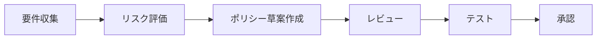
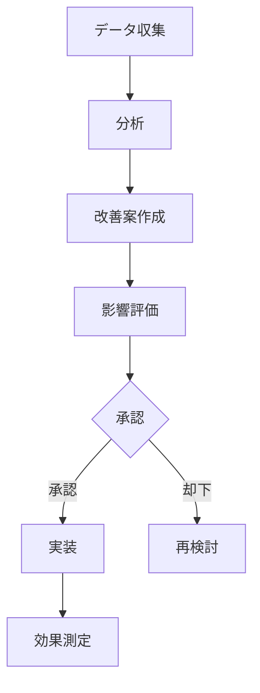
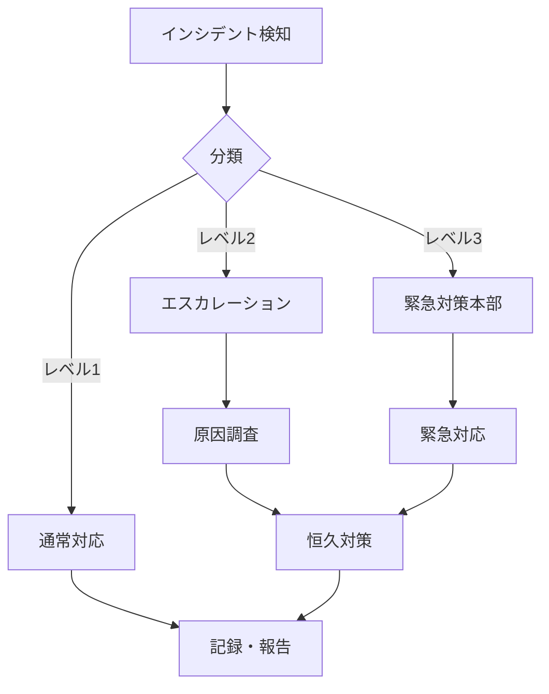

# AEGIS ガバナンス運用ガイド

## 📋 目次

1. [ガバナンス概要](#ガバナンス概要)
2. [組織体制](#組織体制)
3. [ポリシーライフサイクル管理](#ポリシーライフサイクル管理)
4. [監査とコンプライアンス](#監査とコンプライアンス)
5. [リスク管理](#リスク管理)
6. [運用プロセス](#運用プロセス)
7. [KPIとメトリクス](#kpiとメトリクス)
8. [インシデント対応](#インシデント対応)

## ガバナンス概要

### AEGISガバナンスの目的

AEGISのガバナンス体制は、AIエージェントのアクセス制御を通じて以下を実現します：

- **セキュリティ**: 機密データの適切な保護
- **コンプライアンス**: 規制要件への準拠
- **透明性**: 意思決定プロセスの可視化
- **説明責任**: アクセス判定の根拠の明確化
- **継続的改善**: ポリシーと運用の最適化

### ガバナンス原則

1. **最小権限の原則**: 必要最小限のアクセス権限のみ付与
2. **職務分離**: 承認者と実行者の分離
3. **防御の深層化**: 多層的なセキュリティ制御
4. **継続的監視**: リアルタイムでの異常検知
5. **証跡管理**: すべての活動の記録と保存

## 組織体制

### ガバナンス組織図

```
┌─────────────────────────────────────────┐
│         ガバナンス委員会                 │
│  （CISO、CTO、法務、コンプライアンス）   │
└─────────────────┬───────────────────────┘
                  │
    ┌─────────────┴─────────────┐
    │                           │
┌───┴────────┐         ┌───────┴────────┐
│ポリシー管理 │         │セキュリティ運用│
│   チーム    │         │    チーム      │
└─────────────┘         └────────────────┘
    │                           │
┌───┴────────┐         ┌───────┴────────┐
│ビジネス部門 │         │  監査チーム    │
│（要件定義） │         │（監査・評価）  │
└─────────────┘         └────────────────┘
```

### 役割と責任

#### ガバナンス委員会

**責任**:
- ガバナンス戦略の策定
- 重要ポリシーの最終承認
- リスク評価と対応方針決定
- コンプライアンス監督

**メンバー構成**:
- CISO（委員長）
- CTO
- 法務責任者
- コンプライアンス責任者
- 事業部門代表

#### ポリシー管理チーム

**責任**:
- ポリシーの作成・更新
- ポリシー効果の測定
- ステークホルダー調整
- 教育・トレーニング実施

**必要スキル**:
- ビジネス要件の理解
- セキュリティ知識
- 自然言語ポリシー記述能力

#### セキュリティ運用チーム

**責任**:
- 24/7監視体制の維持
- インシデント対応
- 脅威インテリジェンス収集
- システム保守・更新

#### 監査チーム

**責任**:
- 定期監査の実施
- コンプライアンス評価
- 改善提案
- 報告書作成

## ポリシーライフサイクル管理

### 1. ポリシー策定フェーズ



#### 要件収集

**情報源**:
- ビジネス要件
- 規制要件（GDPR、HIPAA等）
- セキュリティ要件
- 技術的制約

**収集方法**:
- ステークホルダーインタビュー
- 既存ポリシーレビュー
- リスクアセスメント
- ベストプラクティス調査

#### ポリシー草案作成

**テンプレート例**:
```
【ポリシー名】: [明確で識別しやすい名前]
【作成日】: [YYYY-MM-DD]
【作成者】: [担当者名]
【承認者】: [承認権限者]
【適用範囲】: [対象システム/データ/ユーザー]

概要：
[このポリシーの目的と背景]

リスク評価：
- 対象リスク: [特定されたリスク]
- リスクレベル: [高/中/低]
- 影響範囲: [影響を受ける領域]

基本原則：
[許可される条件と要件]

制限事項：
[禁止事項とアクセス制限]

必須対応：
[義務と記録要件]

例外処理：
[例外的な許可条件と承認プロセス]

監査要件：
[監査頻度と確認項目]

見直し周期：
[次回レビュー予定日]
```

### 2. ポリシー実装フェーズ

#### テスト計画

```yaml
テスト項目:
  - 正常系:
      - 許可されるべきアクセスが正しく許可されるか
      - 必要な制約が適用されるか
      - 義務が実行されるか
  
  - 異常系:
      - 禁止されるべきアクセスが拒否されるか
      - エッジケースでの動作
      - エラーハンドリング
  
  - パフォーマンス:
      - 判定時間が許容範囲内か
      - 大量リクエスト時の挙動
      - キャッシュの効果

テスト環境:
  - 開発環境での単体テスト
  - ステージング環境での統合テスト
  - 本番相当環境での負荷テスト
```

#### 段階的展開

```
1. パイロット運用（1-2週間）
   - 限定的なユーザーグループ
   - 詳細なモニタリング
   - フィードバック収集

2. 段階的拡大（2-4週間）
   - 部門単位での展開
   - 問題の早期発見と修正
   - 運用手順の確立

3. 全面展開
   - 全ユーザーへの適用
   - 安定運用の確認
   - KPI測定開始
```

### 3. ポリシー運用フェーズ

#### 継続的モニタリング

**監視項目**:
- ポリシー違反の発生率
- 誤検知率（False Positive）
- 見逃し率（False Negative）
- 判定時間
- ユーザー満足度

#### 定期レビュー

**レビュー頻度**:
- 重要ポリシー: 月次
- 一般ポリシー: 四半期
- 低リスクポリシー: 年次

**レビュー観点**:
- 有効性評価
- ビジネス要件との整合性
- 技術的な最適化余地
- 規制変更への対応

### 4. ポリシー改善フェーズ

#### 改善プロセス



## 監査とコンプライアンス

### 監査体制

#### 内部監査

**頻度**: 四半期ごと

**監査項目**:
- ポリシー遵守状況
- アクセスログの完全性
- 権限管理の適切性
- インシデント対応記録
- 改善活動の進捗

**監査手順**:
1. 監査計画の策定
2. 証跡の収集
3. 評価の実施
4. 問題点の特定
5. 改善提案の作成
6. 報告書の提出

#### 外部監査

**頻度**: 年次

**対象**:
- SOC2 Type II認証
- ISO 27001準拠
- 業界固有の規制要件

### コンプライアンス管理

#### 規制マッピング

| 規制 | 要件 | 対応ポリシー | 確認方法 |
|------|------|--------------|----------|
| GDPR | データ最小化 | データアクセス制限ポリシー | アクセスログ監査 |
| GDPR | 忘れられる権利 | データ削除ポリシー | 削除記録確認 |
| HIPAA | アクセス制御 | 医療データポリシー | 権限レビュー |
| SOX | 職務分離 | 財務システムポリシー | 承認フロー監査 |

#### コンプライアンスダッシュボード

```
┌─────────────────────────────────────────────┐
│        コンプライアンススコアカード          │
├─────────────────────────────────────────────┤
│ 全体スコア: 94.5%                           │
├─────────────────────────────────────────────┤
│ GDPR準拠率:        96% ████████████░       │
│ HIPAA準拠率:       92% ███████████░░       │
│ SOX準拠率:         95% ████████████░       │
│ 内部ポリシー準拠:   94% ███████████░░       │
└─────────────────────────────────────────────┘
```

## リスク管理

### リスク評価マトリクス

```
        影響度
    低    中    高
頻 高 [3]  [6]  [9]
度 中 [2]  [5]  [8]
  低 [1]  [4]  [7]

リスクレベル:
1-3: 低リスク（通常運用）
4-6: 中リスク（追加対策検討）
7-9: 高リスク（即時対応必要）
```

### 主要リスクと対策

#### 1. データ漏洩リスク

**リスクレベル**: 高（スコア8）

**対策**:
- 多層防御の実装
- 暗号化の徹底
- アクセス制御の強化
- 定期的な脆弱性診断

#### 2. ポリシー誤設定リスク

**リスクレベル**: 中（スコア6）

**対策**:
- ピアレビュープロセス
- テスト環境での検証
- 段階的展開
- ロールバック手順

#### 3. システム障害リスク

**リスクレベル**: 中（スコア5）

**対策**:
- 高可用性構成
- 自動フェイルオーバー
- 定期的なDRテスト
- SLA監視

## 運用プロセス

### 日次運用

```
09:00 - 朝会
  - 前日のインシデント確認
  - 本日の作業確認
  - リスク情報共有

10:00 - システムチェック
  - ヘルスチェック
  - パフォーマンス確認
  - ログレビュー

14:00 - ポリシー更新
  - 変更要求の処理
  - テスト実施
  - 本番適用

16:00 - 日次レポート
  - KPI集計
  - 異常値分析
  - 翌日の準備
```

### 週次運用

- 月曜: 週次KPIレビュー
- 火曜: セキュリティパッチ適用
- 水曜: ポリシー効果測定
- 木曜: ステークホルダー会議
- 金曜: 改善活動・ドキュメント更新

### 月次運用

- 第1週: 月次レポート作成
- 第2週: ガバナンス委員会
- 第3週: ポリシーレビュー
- 第4週: 次月計画策定

## KPIとメトリクス

### 主要KPI

#### 1. セキュリティKPI

| KPI | 目標値 | 測定方法 |
|-----|--------|----------|
| 不正アクセス検知率 | >99% | 検知数/実際の不正アクセス数 |
| 誤検知率 | <1% | 誤検知数/全アラート数 |
| 平均検知時間 | <5秒 | 発生から検知までの時間 |
| インシデント解決時間 | <4時間 | 検知から解決までの時間 |

#### 2. 運用KPI

| KPI | 目標値 | 測定方法 |
|-----|--------|----------|
| システム稼働率 | >99.9% | 稼働時間/全時間 |
| 平均判定時間 | <100ms | 判定処理時間の平均 |
| ポリシー更新頻度 | 月2-4回 | 更新回数/月 |
| ユーザー満足度 | >4.0/5.0 | アンケート調査 |

#### 3. ビジネスKPI

| KPI | 目標値 | 測定方法 |
|-----|--------|----------|
| コンプライアンス準拠率 | 100% | 準拠項目/全項目 |
| 監査指摘事項数 | <5件/年 | 年間指摘数 |
| ROI | >200% | 効果/投資額 |
| TCO削減率 | >30% | 従来比較 |

### ダッシュボード設計

```
┌─────────────────────────────────────────────┐
│          AEGISガバナンスダッシュボード       │
├─────────────────────────────────────────────┤
│ リアルタイムステータス                       │
│ ├─ アクティブポリシー数: 47                 │
│ ├─ 本日の判定数: 125,432                   │
│ ├─ 拒否率: 2.3%                           │
│ └─ 平均応答時間: 87ms                     │
├─────────────────────────────────────────────┤
│ アラート                                    │
│ ├─ ⚠️ 異常なアクセスパターン検知（3件）      │
│ └─ ℹ️ ポリシー更新予定（2件）              │
├─────────────────────────────────────────────┤
│ トレンド（過去7日間）                       │
│ ├─ アクセス数: ↑ 15%                      │
│ ├─ 拒否率: → 横ばい                       │
│ └─ 処理時間: ↓ 5%改善                     │
└─────────────────────────────────────────────┘
```

## インシデント対応

### インシデント分類

#### レベル1: 低影響
- 単一ユーザーへの影響
- データ漏洩なし
- 自動復旧可能

**対応**: 通常運用チームで対応

#### レベル2: 中影響
- 複数ユーザーへの影響
- 限定的なサービス中断
- 手動介入必要

**対応**: エスカレーション、管理者対応

#### レベル3: 高影響
- 全体サービスへの影響
- データ漏洩の可能性
- 緊急対応必要

**対応**: 緊急対策本部設置

### インシデント対応フロー



### インシデント対応体制

```
インシデントレスポンスチーム（IRT）
├─ インシデントマネージャー
│  └─ 全体統括、意思決定
├─ 技術リード
│  └─ 技術的対応の指揮
├─ コミュニケーション担当
│  └─ ステークホルダー連絡
└─ 記録担当
   └─ 対応記録、報告書作成
```

## まとめ

効果的なAEGISガバナンス運用のポイント：

1. **明確な組織体制**: 役割と責任の明確化
2. **体系的なプロセス**: ポリシーライフサイクル全体の管理
3. **継続的な改善**: PDCAサイクルの実践
4. **透明性の確保**: ダッシュボードとレポーティング
5. **迅速な対応**: インシデント対応体制の確立

これらの要素を組み合わせることで、セキュアで信頼性の高いAIエージェントガバナンスを実現します。